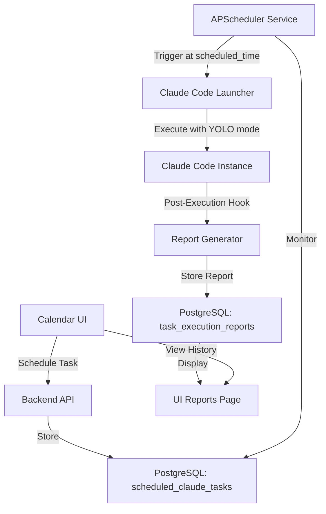

# Calendar Claude Code Integration Architecture

**Date**: 2025-11-18
**Plugin**: ruv-sparc-three-loop-system
**Purpose**: Enable calendar to trigger Claude Code instances in YOLO mode with automated reporting

---

## System Overview



---

## Architecture Components

### 1. Database Schema

#### Table: `scheduled_claude_tasks`

```sql
CREATE TABLE IF NOT EXISTS scheduled_claude_tasks (
    id UUID PRIMARY KEY DEFAULT gen_random_uuid(),

    -- Scheduling Information
    title VARCHAR(255) NOT NULL,
    description TEXT,
    scheduled_time TIMESTAMP WITH TIME ZONE NOT NULL,
    recurrence VARCHAR(50), -- 'once', 'daily', 'weekly', 'monthly'
    recurrence_config JSONB, -- {day_of_week: 1, hour: 14, minute: 0}

    -- Claude Code Configuration
    prompt TEXT NOT NULL, -- The instruction to give Claude
    yolo_mode_enabled BOOLEAN DEFAULT true,
    max_execution_time INTEGER DEFAULT 3600, -- seconds
    working_directory VARCHAR(500),

    -- Agent Configuration
    agent_type VARCHAR(100), -- 'coder', 'researcher', 'reviewer', etc.
    playbook VARCHAR(100), -- Optional playbook to use
    skills TEXT[], -- Array of skills to enable

    -- Context
    project_id UUID REFERENCES projects(id) ON DELETE SET NULL,
    terminal_id UUID REFERENCES terminals(id) ON DELETE SET NULL,

    -- Execution Control
    status VARCHAR(50) DEFAULT 'pending', -- 'pending', 'active', 'completed', 'failed', 'cancelled'
    last_execution_time TIMESTAMP WITH TIME ZONE,
    next_execution_time TIMESTAMP WITH TIME ZONE,
    execution_count INTEGER DEFAULT 0,

    -- Audit
    created_by VARCHAR(255),
    created_at TIMESTAMP WITH TIME ZONE DEFAULT CURRENT_TIMESTAMP,
    updated_at TIMESTAMP WITH TIME ZONE DEFAULT CURRENT_TIMESTAMP,

    -- Metadata
    metadata JSONB DEFAULT '{}'::jsonb
);

-- Indexes
CREATE INDEX idx_scheduled_claude_next_execution ON scheduled_claude_tasks(next_execution_time) WHERE status = 'pending';
CREATE INDEX idx_scheduled_claude_project ON scheduled_claude_tasks(project_id);
CREATE INDEX idx_scheduled_claude_status ON scheduled_claude_tasks(status);
CREATE INDEX idx_scheduled_claude_recurrence ON scheduled_claude_tasks(recurrence);
```

#### Table: `task_execution_reports`

```sql
CREATE TABLE IF NOT EXISTS task_execution_reports (
    id UUID PRIMARY KEY DEFAULT gen_random_uuid(),

    -- Task Reference
    scheduled_task_id UUID REFERENCES scheduled_claude_tasks(id) ON DELETE CASCADE,

    -- Execution Details
    execution_start_time TIMESTAMP WITH TIME ZONE NOT NULL,
    execution_end_time TIMESTAMP WITH TIME ZONE,
    duration_seconds INTEGER,

    -- Results
    status VARCHAR(50) NOT NULL, -- 'success', 'failed', 'timeout', 'error'
    exit_code INTEGER,
    stdout_log TEXT, -- Claude's output
    stderr_log TEXT, -- Error messages

    -- Metrics
    files_created TEXT[], -- Files created during execution
    files_modified TEXT[], -- Files modified
    commands_executed INTEGER DEFAULT 0,
    api_calls_made INTEGER DEFAULT 0,

    -- Agent Activity
    agent_activities JSONB, -- Array of agent activity objects from post-task hooks

    -- Report
    summary TEXT, -- AI-generated summary of what was accomplished
    success BOOLEAN,
    errors TEXT[], -- List of errors encountered

    -- Audit Trail
    created_at TIMESTAMP WITH TIME ZONE DEFAULT CURRENT_TIMESTAMP,

    -- Full Logs
    full_log_path VARCHAR(500), -- Path to complete log file

    CONSTRAINT fk_scheduled_task FOREIGN KEY (scheduled_task_id)
        REFERENCES scheduled_claude_tasks(id) ON DELETE CASCADE
);

-- Indexes
CREATE INDEX idx_task_reports_scheduled_task ON task_execution_reports(scheduled_task_id);
CREATE INDEX idx_task_reports_status ON task_execution_reports(status);
CREATE INDEX idx_task_reports_execution_time ON task_execution_reports(execution_start_time DESC);
```

---

## 2. Backend Implementation

### File: `backend/app/models/scheduled_claude_task.py`

```python
from sqlalchemy import Column, String, Text, DateTime, Boolean, Integer, ForeignKey, ARRAY
from sqlalchemy.dialects.postgresql import UUID, JSONB
from sqlalchemy.orm import relationship
from datetime import datetime, timezone
import uuid

from app.db_setup import Base


class ScheduledClaudeTask(Base):
    __tablename__ = "scheduled_claude_tasks"

    id = Column(UUID(as_uuid=True), primary_key=True, default=uuid.uuid4)

    # Scheduling
    title = Column(String(255), nullable=False)
    description = Column(Text)
    scheduled_time = Column(DateTime(timezone=True), nullable=False)
    recurrence = Column(String(50))  # 'once', 'daily', 'weekly', 'monthly'
    recurrence_config = Column(JSONB, default=dict)

    # Claude Configuration
    prompt = Column(Text, nullable=False)
    yolo_mode_enabled = Column(Boolean, default=True)
    max_execution_time = Column(Integer, default=3600)
    working_directory = Column(String(500))

    # Agent Config
    agent_type = Column(String(100))
    playbook = Column(String(100))
    skills = Column(ARRAY(String))

    # Context
    project_id = Column(UUID(as_uuid=True), ForeignKey('projects.id', ondelete='SET NULL'))
    terminal_id = Column(UUID(as_uuid=True), ForeignKey('terminals.id', ondelete='SET NULL'))

    # Execution
    status = Column(String(50), default='pending')
    last_execution_time = Column(DateTime(timezone=True))
    next_execution_time = Column(DateTime(timezone=True))
    execution_count = Column(Integer, default=0)

    # Audit
    created_by = Column(String(255))
    created_at = Column(DateTime(timezone=True), default=lambda: datetime.now(timezone.utc))
    updated_at = Column(DateTime(timezone=True), default=lambda: datetime.now(timezone.utc), onupdate=lambda: datetime.now(timezone.utc))

    # Metadata
    metadata = Column(JSONB, default=dict)

    # Relationships
    project = relationship("Project", back_populates="scheduled_claude_tasks")
    terminal = relationship("Terminal", back_populates="scheduled_claude_tasks")
    execution_reports = relationship("TaskExecutionReport", back_populates="scheduled_task", cascade="all, delete-orphan")


class TaskExecutionReport(Base):
    __tablename__ = "task_execution_reports"

    id = Column(UUID(as_uuid=True), primary_key=True, default=uuid.uuid4)

    # Task Reference
    scheduled_task_id = Column(UUID(as_uuid=True), ForeignKey('scheduled_claude_tasks.id', ondelete='CASCADE'), nullable=False)

    # Execution
    execution_start_time = Column(DateTime(timezone=True), nullable=False)
    execution_end_time = Column(DateTime(timezone=True))
    duration_seconds = Column(Integer)

    # Results
    status = Column(String(50), nullable=False)
    exit_code = Column(Integer)
    stdout_log = Column(Text)
    stderr_log = Column(Text)

    # Metrics
    files_created = Column(ARRAY(String))
    files_modified = Column(ARRAY(String))
    commands_executed = Column(Integer, default=0)
    api_calls_made = Column(Integer, default=0)

    # Agent Activity
    agent_activities = Column(JSONB)

    # Report
    summary = Column(Text)
    success = Column(Boolean)
    errors = Column(ARRAY(String))

    # Audit
    created_at = Column(DateTime(timezone=True), default=lambda: datetime.now(timezone.utc))

    # Logs
    full_log_path = Column(String(500))

    # Relationships
    scheduled_task = relationship("ScheduledClaudeTask", back_populates="execution_reports")
```

### File: `backend/app/routers/scheduled_claude_tasks.py`

```python
from fastapi import APIRouter, Depends, HTTPException, Query, BackgroundTasks
from sqlalchemy.orm import Session
from pydantic import BaseModel
from typing import List, Optional
from datetime import datetime
import uuid

from app.db_setup import get_db
from app.models.scheduled_claude_task import ScheduledClaudeTask, TaskExecutionReport
from app.services.claude_scheduler import schedule_task, cancel_scheduled_task, trigger_task_now

router = APIRouter(prefix="/scheduled-tasks", tags=["scheduled-claude-tasks"])


class ScheduledTaskCreate(BaseModel):
    title: str
    description: Optional[str] = None
    scheduled_time: datetime
    recurrence: Optional[str] = 'once'  # 'once', 'daily', 'weekly', 'monthly'
    recurrence_config: Optional[dict] = {}

    prompt: str
    yolo_mode_enabled: bool = True
    max_execution_time: int = 3600
    working_directory: Optional[str] = None

    agent_type: Optional[str] = 'general-purpose'
    playbook: Optional[str] = None
    skills: Optional[List[str]] = []

    project_id: Optional[str] = None
    terminal_id: Optional[str] = None

    created_by: Optional[str] = 'system'
    metadata: Optional[dict] = {}


class ScheduledTaskResponse(BaseModel):
    id: str
    title: str
    description: Optional[str]
    scheduled_time: datetime
    recurrence: str

    prompt: str
    yolo_mode_enabled: bool
    agent_type: str

    status: str
    next_execution_time: Optional[datetime]
    execution_count: int

    created_at: datetime
    updated_at: datetime


class ExecutionReportResponse(BaseModel):
    id: str
    scheduled_task_id: str

    execution_start_time: datetime
    execution_end_time: Optional[datetime]
    duration_seconds: Optional[int]

    status: str
    success: bool
    summary: Optional[str]

    files_created: List[str]
    files_modified: List[str]
    commands_executed: int

    created_at: datetime


@router.post("/", response_model=ScheduledTaskResponse)
async def create_scheduled_task(
    task: ScheduledTaskCreate,
    background_tasks: BackgroundTasks,
    db: Session = Depends(get_db)
):
    """Create a new scheduled Claude Code task"""

    # Create database record
    new_task = ScheduledClaudeTask(
        id=uuid.uuid4(),
        title=task.title,
        description=task.description,
        scheduled_time=task.scheduled_time,
        recurrence=task.recurrence,
        recurrence_config=task.recurrence_config,
        prompt=task.prompt,
        yolo_mode_enabled=task.yolo_mode_enabled,
        max_execution_time=task.max_execution_time,
        working_directory=task.working_directory,
        agent_type=task.agent_type,
        playbook=task.playbook,
        skills=task.skills,
        project_id=task.project_id,
        terminal_id=task.terminal_id,
        next_execution_time=task.scheduled_time,
        created_by=task.created_by,
        metadata=task.metadata
    )

    db.add(new_task)
    db.commit()
    db.refresh(new_task)

    # Register with APScheduler
    background_tasks.add_task(schedule_task, str(new_task.id), task.scheduled_time, task.recurrence)

    return ScheduledTaskResponse(
        id=str(new_task.id),
        title=new_task.title,
        description=new_task.description,
        scheduled_time=new_task.scheduled_time,
        recurrence=new_task.recurrence,
        prompt=new_task.prompt,
        yolo_mode_enabled=new_task.yolo_mode_enabled,
        agent_type=new_task.agent_type,
        status=new_task.status,
        next_execution_time=new_task.next_execution_time,
        execution_count=new_task.execution_count,
        created_at=new_task.created_at,
        updated_at=new_task.updated_at
    )


@router.get("/", response_model=List[ScheduledTaskResponse])
async def list_scheduled_tasks(
    limit: int = Query(default=50, le=200),
    status: Optional[str] = None,
    project_id: Optional[str] = None,
    db: Session = Depends(get_db)
):
    """List all scheduled Claude Code tasks"""
    query = db.query(ScheduledClaudeTask).order_by(ScheduledClaudeTask.scheduled_time.asc())

    if status:
        query = query.filter(ScheduledClaudeTask.status == status)
    if project_id:
        query = query.filter(ScheduledClaudeTask.project_id == project_id)

    tasks = query.limit(limit).all()

    return [
        ScheduledTaskResponse(
            id=str(t.id),
            title=t.title,
            description=t.description,
            scheduled_time=t.scheduled_time,
            recurrence=t.recurrence,
            prompt=t.prompt,
            yolo_mode_enabled=t.yolo_mode_enabled,
            agent_type=t.agent_type,
            status=t.status,
            next_execution_time=t.next_execution_time,
            execution_count=t.execution_count,
            created_at=t.created_at,
            updated_at=t.updated_at
        )
        for t in tasks
    ]


@router.get("/{task_id}", response_model=ScheduledTaskResponse)
async def get_scheduled_task(task_id: str, db: Session = Depends(get_db)):
    """Get specific scheduled task details"""
    task = db.query(ScheduledClaudeTask).filter(ScheduledClaudeTask.id == task_id).first()

    if not task:
        raise HTTPException(status_code=404, detail="Task not found")

    return ScheduledTaskResponse(
        id=str(task.id),
        title=task.title,
        description=task.description,
        scheduled_time=task.scheduled_time,
        recurrence=task.recurrence,
        prompt=task.prompt,
        yolo_mode_enabled=task.yolo_mode_enabled,
        agent_type=task.agent_type,
        status=task.status,
        next_execution_time=task.next_execution_time,
        execution_count=task.execution_count,
        created_at=task.created_at,
        updated_at=task.updated_at
    )


@router.delete("/{task_id}")
async def delete_scheduled_task(
    task_id: str,
    background_tasks: BackgroundTasks,
    db: Session = Depends(get_db)
):
    """Delete scheduled task and cancel from scheduler"""
    task = db.query(ScheduledClaudeTask).filter(ScheduledClaudeTask.id == task_id).first()

    if not task:
        raise HTTPException(status_code=404, detail="Task not found")

    # Cancel from APScheduler
    background_tasks.add_task(cancel_scheduled_task, task_id)

    # Delete from database
    db.delete(task)
    db.commit()

    return {"message": "Task deleted successfully", "task_id": task_id}


@router.post("/{task_id}/trigger")
async def trigger_task_manually(
    task_id: str,
    background_tasks: BackgroundTasks,
    db: Session = Depends(get_db)
):
    """Manually trigger task execution immediately"""
    task = db.query(ScheduledClaudeTask).filter(ScheduledClaudeTask.id == task_id).first()

    if not task:
        raise HTTPException(status_code=404, detail="Task not found")

    # Trigger execution in background
    background_tasks.add_task(trigger_task_now, task_id)

    return {"message": "Task triggered", "task_id": task_id}


@router.get("/{task_id}/reports", response_model=List[ExecutionReportResponse])
async def get_task_execution_reports(
    task_id: str,
    limit: int = Query(default=20, le=100),
    db: Session = Depends(get_db)
):
    """Get execution history for a scheduled task"""
    reports = db.query(TaskExecutionReport).filter(
        TaskExecutionReport.scheduled_task_id == task_id
    ).order_by(
        TaskExecutionReport.execution_start_time.desc()
    ).limit(limit).all()

    return [
        ExecutionReportResponse(
            id=str(r.id),
            scheduled_task_id=str(r.scheduled_task_id),
            execution_start_time=r.execution_start_time,
            execution_end_time=r.execution_end_time,
            duration_seconds=r.duration_seconds,
            status=r.status,
            success=r.success,
            summary=r.summary,
            files_created=r.files_created or [],
            files_modified=r.files_modified or [],
            commands_executed=r.commands_executed,
            created_at=r.created_at
        )
        for r in reports
    ]
```

---

## 3. Claude Code Scheduler Service

### File: `backend/app/services/claude_scheduler.py`

```python
"""
APScheduler-based service for triggering Claude Code instances
Uses APScheduler to monitor scheduled_claude_tasks and execute at scheduled times
"""

from apscheduler.schedulers.background import BackgroundScheduler
from apscheduler.triggers.date import DateTrigger
from apscheduler.triggers.cron import CronTrigger
from datetime import datetime, timezone
import subprocess
import json
import os
import logging

from app.db_setup import SessionLocal
from app.models.scheduled_claude_task import ScheduledClaudeTask, TaskExecutionReport

logger = logging.getLogger(__name__)

# Global scheduler instance
scheduler = BackgroundScheduler()


def init_scheduler():
    """Initialize APScheduler on application startup"""
    scheduler.start()
    logger.info("Claude Code Scheduler initialized")

    # Load existing pending tasks from database
    load_pending_tasks()


def shutdown_scheduler():
    """Shutdown scheduler gracefully"""
    scheduler.shutdown(wait=True)
    logger.info("Claude Code Scheduler shutdown")


def load_pending_tasks():
    """Load all pending tasks from database and schedule them"""
    db = SessionLocal()
    try:
        pending_tasks = db.query(ScheduledClaudeTask).filter(
            ScheduledClaudeTask.status == 'pending',
            ScheduledClaudeTask.next_execution_time.isnot(None)
        ).all()

        for task in pending_tasks:
            schedule_task(str(task.id), task.next_execution_time, task.recurrence)
            logger.info(f"Loaded pending task: {task.title} (ID: {task.id})")

    finally:
        db.close()


def schedule_task(task_id: str, scheduled_time: datetime, recurrence: str = 'once'):
    """Add task to APScheduler"""
    job_id = f"claude_task_{task_id}"

    # Remove existing job if present
    if scheduler.get_job(job_id):
        scheduler.remove_job(job_id)

    if recurrence == 'once':
        trigger = DateTrigger(run_date=scheduled_time)
    elif recurrence == 'daily':
        trigger = CronTrigger(hour=scheduled_time.hour, minute=scheduled_time.minute)
    elif recurrence == 'weekly':
        trigger = CronTrigger(
            day_of_week=scheduled_time.weekday(),
            hour=scheduled_time.hour,
            minute=scheduled_time.minute
        )
    elif recurrence == 'monthly':
        trigger = CronTrigger(
            day=scheduled_time.day,
            hour=scheduled_time.hour,
            minute=scheduled_time.minute
        )
    else:
        trigger = DateTrigger(run_date=scheduled_time)

    scheduler.add_job(
        execute_claude_task,
        trigger=trigger,
        id=job_id,
        args=[task_id],
        replace_existing=True
    )

    logger.info(f"Scheduled task {task_id} at {scheduled_time} (recurrence: {recurrence})")


def cancel_scheduled_task(task_id: str):
    """Remove task from APScheduler"""
    job_id = f"claude_task_{task_id}"

    if scheduler.get_job(job_id):
        scheduler.remove_job(job_id)
        logger.info(f"Cancelled scheduled task: {task_id}")


def trigger_task_now(task_id: str):
    """Execute task immediately (manual trigger)"""
    execute_claude_task(task_id)


def execute_claude_task(task_id: str):
    """
    Execute Claude Code instance with YOLO mode
    This is called by APScheduler at scheduled time
    """
    db = SessionLocal()

    try:
        # Get task from database
        task = db.query(ScheduledClaudeTask).filter(ScheduledClaudeTask.id == task_id).first()

        if not task:
            logger.error(f"Task not found: {task_id}")
            return

        logger.info(f"Executing Claude Code task: {task.title} (ID: {task_id})")

        # Update task status
        task.status = 'active'
        task.last_execution_time = datetime.now(timezone.utc)
        task.execution_count += 1
        db.commit()

        # Create execution report
        report = TaskExecutionReport(
            scheduled_task_id=task.id,
            execution_start_time=datetime.now(timezone.utc),
            status='running',
            success=False
        )
        db.add(report)
        db.commit()

        # Execute Claude Code
        result = run_claude_code_instance(task)

        # Update report with results
        report.execution_end_time = datetime.now(timezone.utc)
        report.duration_seconds = (report.execution_end_time - report.execution_start_time).total_seconds()
        report.status = 'success' if result['success'] else 'failed'
        report.success = result['success']
        report.exit_code = result.get('exit_code', 0)
        report.stdout_log = result.get('stdout', '')
        report.stderr_log = result.get('stderr', '')
        report.summary = result.get('summary', '')
        report.files_created = result.get('files_created', [])
        report.files_modified = result.get('files_modified', [])
        report.commands_executed = result.get('commands_executed', 0)
        report.full_log_path = result.get('log_path', '')

        db.commit()

        # Update task status
        task.status = 'pending' if task.recurrence != 'once' else 'completed'
        if task.recurrence != 'once':
            task.next_execution_time = calculate_next_execution_time(task)
        db.commit()

        logger.info(f"Task execution completed: {task.title} (success: {result['success']})")

    except Exception as e:
        logger.error(f"Error executing task {task_id}: {str(e)}")

        # Update task status to failed
        if task:
            task.status = 'failed'
            db.commit()

    finally:
        db.close()


def run_claude_code_instance(task: ScheduledClaudeTask) -> dict:
    """
    Launch Claude Code CLI with YOLO mode and capture results
    """
    log_dir = os.path.join(os.getcwd(), 'logs', 'scheduled-claude-tasks')
    os.makedirs(log_dir, exist_ok=True)

    log_file_path = os.path.join(log_dir, f"{task.id}_{datetime.now().strftime('%Y%m%d_%H%M%S')}.log")

    # Prepare Claude Code command
    working_dir = task.working_directory or os.getcwd()

    # Build command with YOLO mode enabled
    # YOLO mode means Claude executes autonomously without asking for permission
    cmd = [
        'claude',
        '--yolo',  # YOLO mode (autonomous execution)
        '--cwd', working_dir,
        '--output-log', log_file_path,
        '--max-time', str(task.max_execution_time),
        '--prompt', task.prompt
    ]

    # Add agent type if specified
    if task.agent_type:
        cmd.extend(['--agent', task.agent_type])

    # Add playbook if specified
    if task.playbook:
        cmd.extend(['--playbook', task.playbook])

    # Add skills if specified
    if task.skills:
        cmd.extend(['--skills', ','.join(task.skills)])

    logger.info(f"Running Claude Code: {' '.join(cmd)}")

    try:
        # Execute Claude Code
        result = subprocess.run(
            cmd,
            cwd=working_dir,
            capture_output=True,
            text=True,
            timeout=task.max_execution_time
        )

        # Parse results from log file
        execution_summary = parse_execution_log(log_file_path)

        return {
            'success': result.returncode == 0,
            'exit_code': result.returncode,
            'stdout': result.stdout,
            'stderr': result.stderr,
            'log_path': log_file_path,
            'summary': execution_summary.get('summary', ''),
            'files_created': execution_summary.get('files_created', []),
            'files_modified': execution_summary.get('files_modified', []),
            'commands_executed': execution_summary.get('commands_executed', 0)
        }

    except subprocess.TimeoutExpired:
        logger.error(f"Claude Code execution timeout for task {task.id}")
        return {
            'success': False,
            'exit_code': -1,
            'stdout': '',
            'stderr': 'Execution timeout',
            'log_path': log_file_path,
            'summary': 'Task execution timed out',
            'files_created': [],
            'files_modified': [],
            'commands_executed': 0
        }

    except Exception as e:
        logger.error(f"Error running Claude Code: {str(e)}")
        return {
            'success': False,
            'exit_code': -1,
            'stdout': '',
            'stderr': str(e),
            'log_path': log_file_path,
            'summary': f'Execution error: {str(e)}',
            'files_created': [],
            'files_modified': [],
            'commands_executed': 0
        }


def parse_execution_log(log_path: str) -> dict:
    """Parse Claude Code execution log to extract metrics"""
    summary = {
        'summary': '',
        'files_created': [],
        'files_modified': [],
        'commands_executed': 0
    }

    try:
        if not os.path.exists(log_path):
            return summary

        with open(log_path, 'r', encoding='utf-8') as f:
            log_content = f.read()

        # Extract metrics from log
        # This is a simplified parser - customize based on Claude Code log format
        lines = log_content.split('\n')

        for line in lines:
            if 'Created file:' in line or 'Write' in line:
                # Extract file path
                file_path = line.split(':')[-1].strip()
                summary['files_created'].append(file_path)

            elif 'Modified file:' in line or 'Edit' in line:
                file_path = line.split(':')[-1].strip()
                summary['files_modified'].append(file_path)

            elif 'Bash' in line or 'command' in line:
                summary['commands_executed'] += 1

        # Generate summary
        summary['summary'] = f"Created {len(summary['files_created'])} files, modified {len(summary['files_modified'])} files, executed {summary['commands_executed']} commands"

    except Exception as e:
        logger.error(f"Error parsing execution log: {str(e)}")

    return summary


def calculate_next_execution_time(task: ScheduledClaudeTask) -> datetime:
    """Calculate next execution time based on recurrence"""
    from datetime import timedelta

    now = datetime.now(timezone.utc)

    if task.recurrence == 'daily':
        return now + timedelta(days=1)
    elif task.recurrence == 'weekly':
        return now + timedelta(weeks=1)
    elif task.recurrence == 'monthly':
        return now + timedelta(days=30)
    else:
        return None
```

---

## 4. Integration with Backend

### File: `backend/app/main.py` (add to existing)

```python
from app.routers import scheduled_claude_tasks
from app.services.claude_scheduler import init_scheduler, shutdown_scheduler

# Add router
app.include_router(scheduled_claude_tasks.router, prefix="/api/v1", tags=["scheduled-claude-tasks"])

# Lifecycle events
@app.on_event("startup")
async def startup_event():
    init_scheduler()
    logger.info("Claude Code Scheduler started")

@app.on_event("shutdown")
async def shutdown_event():
    shutdown_scheduler()
    logger.info("Claude Code Scheduler stopped")
```

---

## 5. Frontend Calendar Integration

### File: `frontend/src/components/ScheduleClaudeTask.tsx`

```typescript
import React, { useState } from 'react';
import { Dialog, DialogContent, DialogHeader, DialogTitle } from '@/components/ui/dialog';
import { Button } from '@/components/ui/button';
import { Input } from '@/components/ui/input';
import { Textarea } from '@/components/ui/textarea';
import { Select, SelectContent, SelectItem, SelectTrigger, SelectValue } from '@/components/ui/select';

interface ScheduleClaudeTaskDialogProps {
  open: boolean;
  onClose: () => void;
  selectedDate?: Date;
}

export function ScheduleClaudeTaskDialog({ open, onClose, selectedDate }: ScheduleClaudeTaskDialogProps) {
  const [title, setTitle] = useState('');
  const [prompt, setPrompt] = useState('');
  const [scheduledTime, setScheduledTime] = useState(selectedDate || new Date());
  const [recurrence, setRecurrence] = useState('once');
  const [agentType, setAgentType] = useState('general-purpose');
  const [yoloMode, setYoloMode] = useState(true);

  const handleSubmit = async () => {
    const response = await fetch('http://localhost:8000/api/v1/scheduled-tasks/', {
      method: 'POST',
      headers: { 'Content-Type': 'application/json' },
      body: JSON.stringify({
        title,
        prompt,
        scheduled_time: scheduledTime.toISOString(),
        recurrence,
        agent_type: agentType,
        yolo_mode_enabled: yoloMode,
        max_execution_time: 3600
      })
    });

    if (response.ok) {
      alert('Claude Code task scheduled successfully!');
      onClose();
    }
  };

  return (
    <Dialog open={open} onOpenChange={onClose}>
      <DialogContent className="max-w-2xl">
        <DialogHeader>
          <DialogTitle>Schedule Claude Code Task</DialogTitle>
        </DialogHeader>

        <div className="space-y-4">
          <div>
            <label className="text-sm font-medium">Task Title</label>
            <Input
              value={title}
              onChange={(e) => setTitle(e.target.value)}
              placeholder="Daily code review"
            />
          </div>

          <div>
            <label className="text-sm font-medium">Prompt (what should Claude do?)</label>
            <Textarea
              value={prompt}
              onChange={(e) => setPrompt(e.target.value)}
              placeholder="Review all PRs and add comments with suggestions for improvement"
              rows={5}
            />
          </div>

          <div>
            <label className="text-sm font-medium">Scheduled Time</label>
            <Input
              type="datetime-local"
              value={scheduledTime.toISOString().slice(0, 16)}
              onChange={(e) => setScheduledTime(new Date(e.target.value))}
            />
          </div>

          <div>
            <label className="text-sm font-medium">Recurrence</label>
            <Select value={recurrence} onValueChange={setRecurrence}>
              <SelectTrigger>
                <SelectValue />
              </SelectTrigger>
              <SelectContent>
                <SelectItem value="once">Once</SelectItem>
                <SelectItem value="daily">Daily</SelectItem>
                <SelectItem value="weekly">Weekly</SelectItem>
                <SelectItem value="monthly">Monthly</SelectItem>
              </SelectContent>
            </Select>
          </div>

          <div>
            <label className="text-sm font-medium">Agent Type</label>
            <Select value={agentType} onValueChange={setAgentType}>
              <SelectTrigger>
                <SelectValue />
              </SelectTrigger>
              <SelectContent>
                <SelectItem value="general-purpose">General Purpose</SelectItem>
                <SelectItem value="coder">Coder</SelectItem>
                <SelectItem value="researcher">Researcher</SelectItem>
                <SelectItem value="reviewer">Code Reviewer</SelectItem>
                <SelectItem value="tester">Tester</SelectItem>
              </SelectContent>
            </Select>
          </div>

          <div className="flex items-center space-x-2">
            <input
              type="checkbox"
              checked={yoloMode}
              onChange={(e) => setYoloMode(e.target.checked)}
              id="yolo-mode"
            />
            <label htmlFor="yolo-mode" className="text-sm">
              Enable YOLO Mode (autonomous execution without prompts)
            </label>
          </div>

          <div className="flex justify-end space-x-2">
            <Button variant="outline" onClick={onClose}>Cancel</Button>
            <Button onClick={handleSubmit} disabled={!title || !prompt}>
              Schedule Task
            </Button>
          </div>
        </div>
      </DialogContent>
    </Dialog>
  );
}
```

---

## 6. Dependencies

### Add to `backend/requirements.txt`:

```
APScheduler==3.10.4
```

---

## 7. Setup Instructions

### Step 1: Database Migration

```bash
cd C:\Users\17175\terminal-manager\backend

# Run migration
python -c "from app.db_setup import engine; from app.models.scheduled_claude_task import ScheduledClaudeTask, TaskExecutionReport; Base.metadata.create_all(engine)"
```

### Step 2: Install Dependencies

```bash
pip install APScheduler==3.10.4
```

### Step 3: Update Backend

```bash
# Add router to app/main.py
# Add scheduler lifecycle hooks
```

### Step 4: Test Calendar Integration

```bash
# Start backend
python -m uvicorn app.main:app --host 0.0.0.0 --port 8000 --reload

# Create test scheduled task
curl -X POST http://localhost:8000/api/v1/scheduled-tasks/ \
  -H "Content-Type: application/json" \
  -d '{
    "title": "Test Claude Task",
    "prompt": "Create a hello world Python script",
    "scheduled_time": "2025-11-18T16:00:00Z",
    "recurrence": "once",
    "yolo_mode_enabled": true,
    "agent_type": "coder"
  }'

# List scheduled tasks
curl http://localhost:8000/api/v1/scheduled-tasks/

# View execution reports
curl http://localhost:8000/api/v1/scheduled-tasks/{task-id}/reports
```

---

## 8. Security Considerations

1. **YOLO Mode Safety**:
   - Limit execution time (max_execution_time)
   - Restrict working directories (validate paths)
   - Implement command whitelisting
   - Log all executions

2. **Authentication**:
   - Require authentication for scheduling
   - Implement RBAC for task creation/deletion
   - Audit trail for all operations

3. **Resource Limits**:
   - Max concurrent executions
   - Timeout enforcement
   - Disk space monitoring

---

## 9. Monitoring & Observability

- **Metrics**:
  - Task execution success rate
  - Average execution duration
  - Queue depth
  - Failed task retry count

- **Alerts**:
  - Task execution failures
  - Scheduler downtime
  - Timeout exceeded

- **Logs**:
  - Structured logging via hooks
  - OpenTelemetry integration
  - Execution reports stored in database

---

## 10. Future Enhancements

1. **Advanced Scheduling**:
   - Cron expression support
   - Time zone awareness
   - Holiday exclusions

2. **Workflow Orchestration**:
   - Multi-task workflows (task A → task B → task C)
   - Conditional execution (if task A succeeds, run task B)
   - Parallel task execution

3. **UI Enhancements**:
   - Calendar view with scheduled tasks
   - Execution history timeline
   - Real-time execution monitoring
   - Report viewer with syntax highlighting

4. **Integration**:
   - Webhook triggers (GitHub PR opened → run review)
   - External calendar sync (Google Calendar, Outlook)
   - Email notifications on completion
